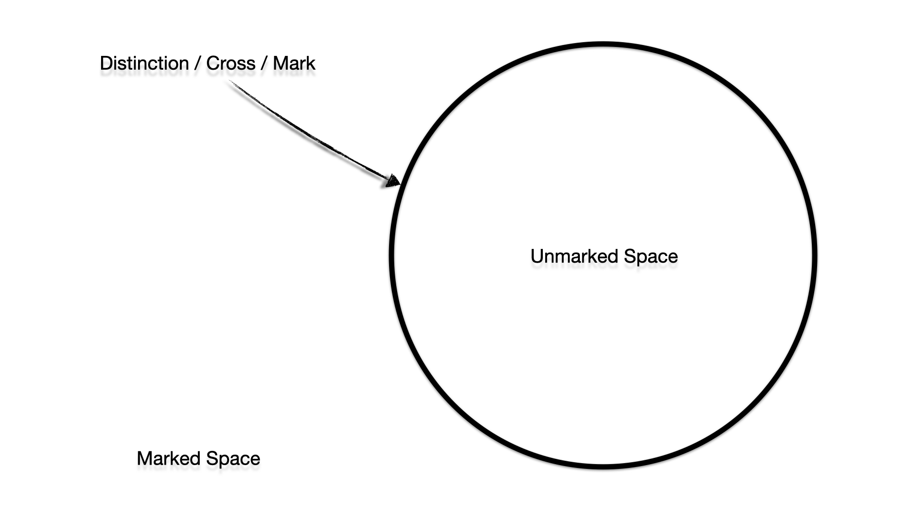
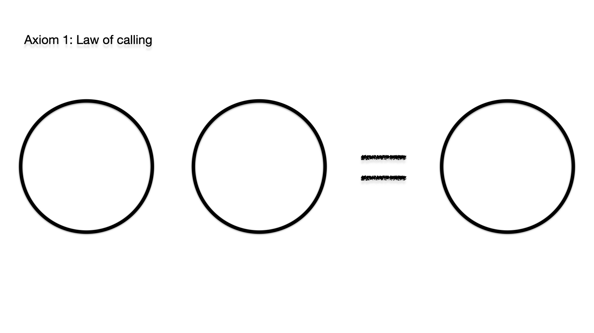
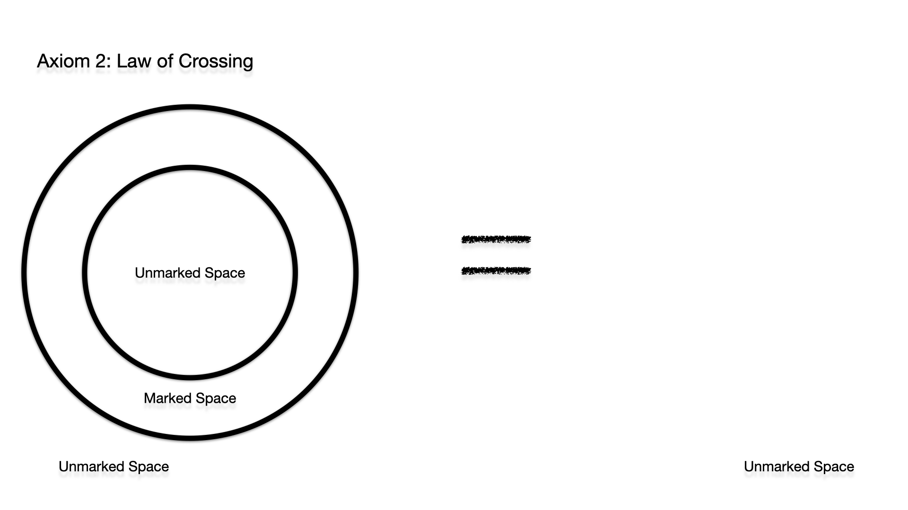
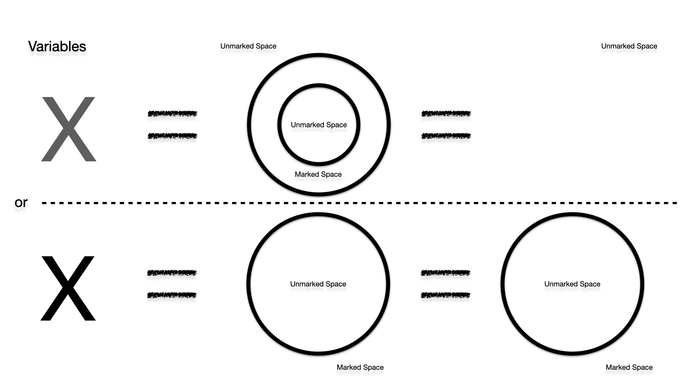
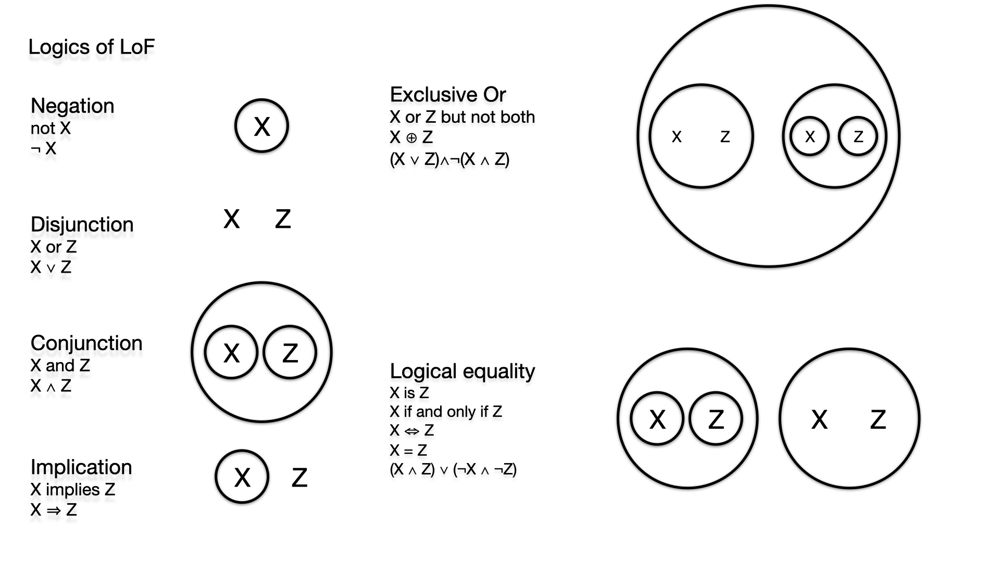

# Laws of Form Simulator

[Live Demo - Draw a distinction!](https://lawsofform.web.app/ "Draw a distinction!")

## About

In 1969 George Spencer-Brown published the work »Laws of Form« (LoF),
in this work he tried to build arithmetic, algebra, and logic on
the basis of a single operation, the distinction. This
distinction, also called mark or cross, is at the same time
operation as well as operand, which is applied in a space (here
the infinitely large white area). If there is a cross in a
space, i.e. a distinction has been made, then this space is
marked. However, if you go into the area that was distinguished
by the distinction (inside and outside), it will be unmarked
again unless you introduce another distinction there.

Everything is on the most outer layer enclosed by an »unwritten cross«. You could
see that as in this case the edge of the screen, of the computer
or as the observer (who distinguishes himself at the same time)
in whose perceptual space the distinctions are carried out.

## Axioms

Every mathematical system is based on axioms, simply accepted
and fixed rules. In LoF there are exactly two axioms. The first
one is »The law of Calling«. Making a distinction twice is
equivalent to making a single distinction. For example, if I
call the »car« (which is equivalent to making a distinction) and
then call the »car« again, it is the same as if I called the
car once.

The second axiom is »The law of Crossing«. A distinction in a
distinction annuls the distinction. In this case, if I have two
distinctions stacked inside each other, then that is equivalent
to the unmarked state. Each expression can be transformed into
exactly one of two states, the marked or unmarked space (we
ignore here the re-entry indicated in LoF).

## Variables

In addition, different variables can be introduced that can
stand for either a mark or no mark. This is equivalent to
whether the mark has a marked area inside and is thus nihilated
by the second axiom »law of crossing« or not. These are
individually toggleable in this simulator. Crosses and Variables
(which have a collision check of a circle) are not allowed to
intersect.

## Logic

Logic can also be practiced with the help of this single
operation. A marked area represents a true value, an unmarked
one a false one. The simplest logical operation is that of
negation. A cross around a variable negates it by the second
axiom, if the variable is a cross or not. Two variables in the
same space are a logical or. A cross and no cross are just one
cross and two crosses are by the first axiom equivalent to one
cross, but no crosses at all are just no crosses. Further logical
functions can be taken from the picture below. In the simulator,
a logic table can be generated and displayed on the basis of the
current expression.

The simulator offers several functions. The Run function applies
both axioms to the current expression until the expression has
been fully converted to a marked or unmarked state.

## More
In addition, the show function can be used to visualize whether
the respective cross exists from the space outside the cross
(solid line) or not (dashed line).You can use any number of
crosses and variables even nested, the only rule is that they
must not intersect (variables have a circular collision
detection as mentioned).

You can zoom in thousands of times (at some point you reach the
limits of precision of the computer) and zoom out, apply
distinctions here or there. The Move function is only relevant
for the PC, with it you can move on the white surface, on the
smartphone touch gestures do the trick.

LoF also offers non-negligible epistemological implications in
the field of radical constructivism. It provides a solid basis
for explaining autopoetic systems (Humberto Maturana and
Francisco Varela) and for deriving theories of observation and
systemtheory (Niklas Luhmann) and cybernetic concepts (Heinz von
Foerster). Moreover, there are opinions that the statements
presented in Laws of Form are the basis of all cognition. In
this simulator, however, only the basics will be presented.

